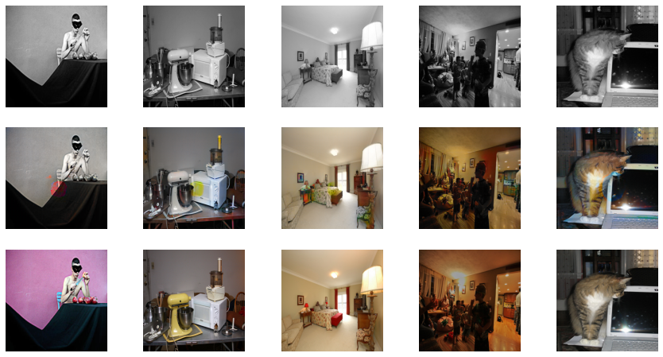

# GAN-Colorizer
Colorization of Black &amp; White Images using Generative Adversarial Networks.

Epoch 2:

Epoch 7:

Epoch 13:

Epoch 15:

Epoch 20:

Epoch 23:

Epoch 27:

Epoch 30:

Epoch 33:

Epoch 34:

Epoch 35:

Epoch 40:

Epoch 47:

